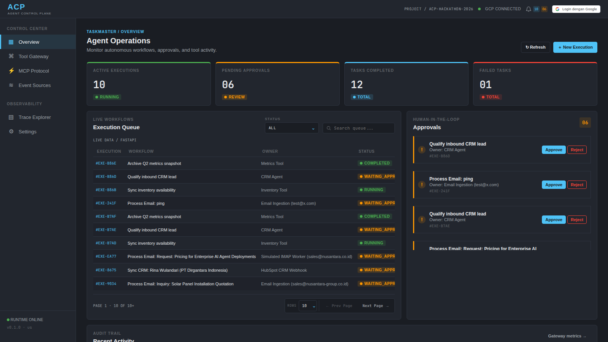
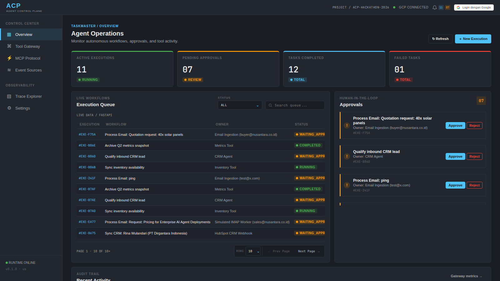
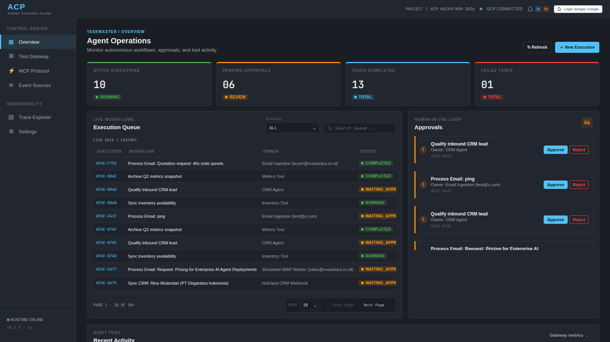
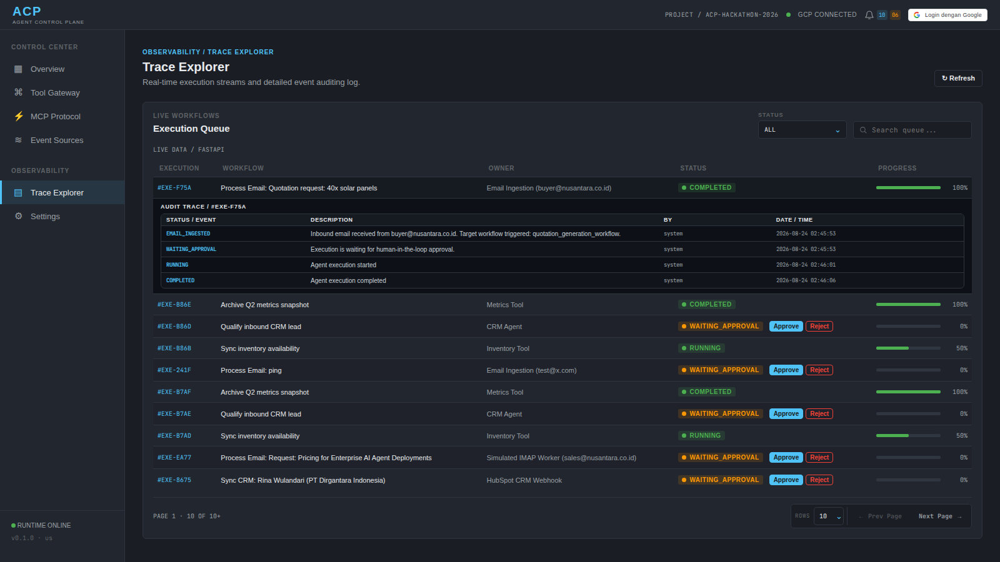
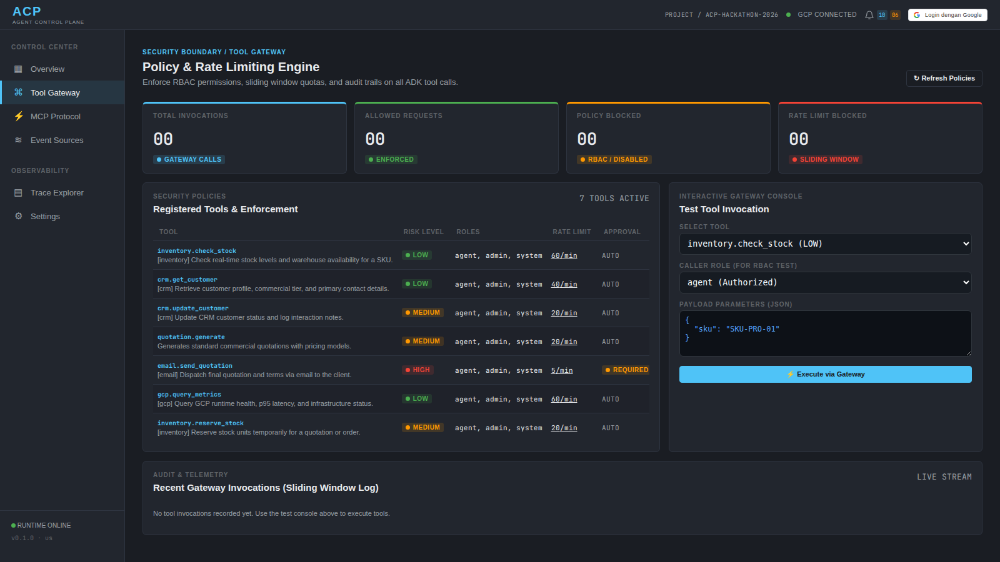
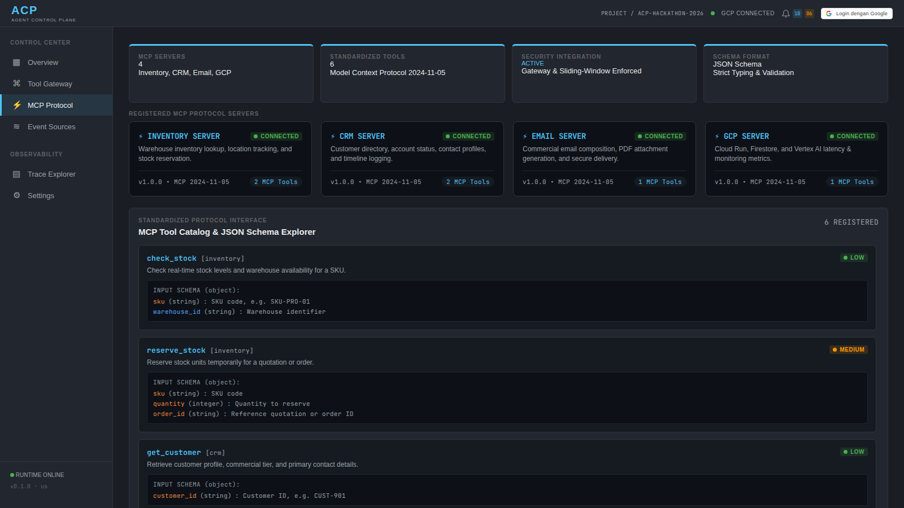
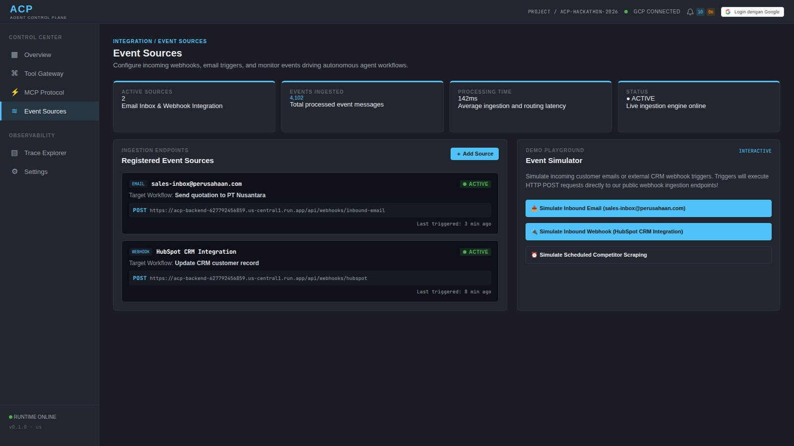
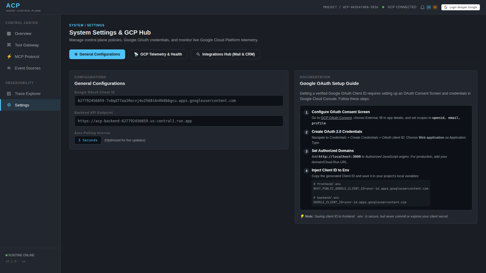

# Agent Control Plane

> Control plane for autonomous Gemini agent workflows — human-gated, tool-secured, fully audited.

[](https://www.python.org/)
[](https://fastapi.tiangolo.com/)
[](https://google.github.io/adk-docs/)
[](https://cloud.google.com/vertex-ai)
[](https://cloud.run)
[](LICENSE)

**All Things Agentic Hackathon 2026** — Track: *The Taskmaster*

## Table of Contents

- [Overview](#overview)
- [Why ACP](#why-acp)
- [Features](#features)
- [Technology Stack](#technology-stack)
- [Architecture](#architecture)
- [Screenshots](#screenshots)
- [Demo](#demo)
- [Installation](#installation)
- [Environment Variables](#environment-variables)
- [Running Locally](#running-locally)
- [Verification](#verification)
- [Project Structure](#project-structure)
- [Deployment](#deployment)
- [Project Status](#project-status)
- [Known Limitations](#known-limitations)
- [Documentation](#documentation)
- [Security Rules](#security-rules)
- [License](#license)

## Overview

Most agent demos stop at chat. Agent Control Plane (ACP) proves execution: an
inbound email or CRM webhook spawns an execution, a Gemini agent plans and acts
through a secured Tool Gateway, state lives in Firestore, and every step lands
in an audit trail a human can inspect.

```text
Google sign-in -> create execution -> human approval -> ADK Gemini runner
-> Firestore state -> polling -> result and audit trace
```

- Execution lifecycle: QUEUED, RUNNING, WAITING_APPROVAL, COMPLETED, FAILED, CANCELLED.
- Approval requires a verified Google ID token; the verified actor is stored in the audit trail.
- Workflows can also run fully autonomous when approval is not required.

## Why ACP

Autonomy without governance is a demo; governance without autonomy is a form.
ACP ships both in one state machine: agents do the heavy lifting in the
background, humans step in only where policy says so, and everything is
auditable either way.

## Features

### Workflow execution

- Execution lifecycle with live 3-second polling in the operations dashboard
- Background ADK runner (Google ADK 2.7.1, Gemini 3.5 Flash via Vertex AI)
- Firestore cursor pagination with server-side status/search filters
- Optional human-in-the-loop approval gate (verified Google identity)

### Governance and security

- Tool Gateway: RBAC roles, risk classification (LOW → CRITICAL), per-tool policies
- Sliding-window rate limits backed by Firestore transactions — one shared
  quota across all Cloud Run instances, fail-closed
- Admin-only policy management via `ADMIN_EMAILS`

### Integrations

- Inbound email + HubSpot webhook endpoints that spawn real executions
- Background IMAP polling daemon with simulation fallback for demos
- Dynamic integrations config stored in Firestore, managed from the UI

### MCP and tools

- Four typed MCP servers (inventory, crm, email, gcp monitoring) over JSON-RPC 2.0
- All MCP tool calls pass through the same gateway boundary
- Interactive MCP tester and gateway console in the dashboard

### Observability

- Audit trace per execution: `executions/{id}/events` — the single audit system
- Structured JSON logs with Cloud Logging severity mapping (stdlib only)
- Live GCP connectivity diagnostics from the Settings page

## Technology Stack

| Layer | Technology |
|---|---|
| Frontend | Next.js App Router, TypeScript, custom dark ops CSS |
| Backend | Python 3.12, FastAPI, Uvicorn |
| Agent runtime | Google ADK 2.7.1 (Agent, Runner, InMemorySessionService) |
| Model | Gemini 3.5 Flash via Vertex AI (locked configuration) |
| Database | Firestore (executions, audit events, config, rate-limit state) |
| Auth | Google OAuth Web Client ID + verified ID tokens |
| Infra | Cloud Run, Artifact Registry, Cloud Build |

## Architecture


## Screenshots

The screenshots below follow the complete workflow from ingestion to audit.

### Workflow execution

| Dashboard | Inbound email execution |
|---|---|
|  |  |

| Execution completed | Audit trace |
|---|---|
|  |  |

### Governance and integrations

| Tool Gateway | MCP Protocol |
|---|---|
|  |  |

| Event Sources | Settings |
|---|---|
|  |  |

## Demo

Automated walkthrough of the live Cloud Run deployment (lifecycle transitions
driven by real Firestore writes): `docs/demo_video/acp_demo_walkthrough.mp4`.

Final hackathon video (≤4 min): `docs/demo_video/acp_demo_submission.mp4`
(problem → value → architecture → GCP proof → live demo → audit/gateway/MCP →
autonomy run → close).

Watch on YouTube: https://youtu.be/jc5g__1-8Y0

## Installation

Requirements: Python 3.12, Node.js.

```bash
python -m venv venv && source venv/bin/activate
pip install -r backend/requirements.txt
cd frontend && npm install
```

## Environment Variables

Copy the templates and fill in your values — never commit real credentials:

```bash
cp backend/.env.example backend/.env
cp frontend/.env.example frontend/.env
```

| Variable | Where | Purpose |
|---|---|---|
| `GOOGLE_CLIENT_ID` | backend | OAuth Web Client ID for token verification |
| `ADMIN_EMAILS` | backend | Emails granted the admin role |
| `RATE_LIMIT_BACKEND` | backend | `memory` (local) or `firestore` (Cloud Run) |
| `FRONTEND_ORIGIN` | backend | CORS origin of the deployed frontend |
| `NEXT_PUBLIC_API_BASE_URL` | frontend | Backend base URL |
| `NEXT_PUBLIC_GOOGLE_CLIENT_ID` | frontend | Public OAuth client ID |

Google ADC (`gcloud auth application-default login`) is required for Vertex AI
and Firestore wherever the backend runs.

## Running Locally

```bash
uvicorn backend.main:app --reload --port 8080   # backend on :8080
cd frontend && npm run dev                      # frontend on :3000
```

## Verification

```bash
./venv/bin/python -m compileall -q backend
./venv/bin/python -c "from backend.main import app; print(app.title)"
./venv/bin/python -m backend.test_rate_limiter
./venv/bin/python scripts/e2e_acceptance_test.py
cd frontend && npm run build
```

## Project Structure

```text
agent-control-plane/
├── backend/
│   ├── main.py        # FastAPI app: executions, approvals, webhooks, integrations
│   ├── agent.py       # Google ADK + Gemini runner
│   ├── gateway.py     # Tool Gateway: RBAC, risk levels, rate limits
│   ├── mcp.py         # MCP registry + JSON-RPC 2.0 layer
│   ├── auth.py        # Google token verification, admin derivation
│   └── Dockerfile     # Multi-stage, non-root runtime user
├── frontend/
│   ├── app/           # Next.js dashboard
│   └── Dockerfile     # Standalone build for Cloud Run
├── docs/
│   ├── architecture.svg
│   ├── DEVPOST_SUBMISSION.md
│   ├── screenshot/    # Workflow screenshots
│   └── demo_video/    # Automated walkthrough
├── scripts/
│   ├── deploy-cloud-run.sh
│   ├── verify-container.sh
│   ├── capture_demo.py
│   └── e2e_acceptance_test.py
└── cloudbuild.yaml
```

## Deployment

Live services (us-central1, project `acp-hackathon-2026-505906`):

- Backend: https://acp-backend-627792456859.us-central1.run.app
- Frontend: https://acp-frontend-627792456859.us-central1.run.app

Redeploy backend: `scripts/deploy-cloud-run.sh` (see `CLOUD_RUN.md` runbook).
Redeploy frontend:

```bash
cd frontend
docker build \
  --build-arg NEXT_PUBLIC_API_BASE_URL=https://acp-backend-627792456859.us-central1.run.app \
  --build-arg NEXT_PUBLIC_GOOGLE_CLIENT_ID=$NEXT_PUBLIC_GOOGLE_CLIENT_ID \
  -t us-central1-docker.pkg.dev/acp-hackathon-2026-505906/acp/acp-frontend:latest .
docker push us-central1-docker.pkg.dev/acp-hackathon-2026-505906/acp/acp-frontend:latest
gcloud run deploy acp-frontend --region us-central1 \
  --image us-central1-docker.pkg.dev/acp-hackathon-2026-505906/acp/acp-frontend:latest \
  --allow-unauthenticated
```

Operational checks: `/health`, `/config`, `/api/gateway/metrics`,
`POST /api/gcp/diagnostics` (Bearer token required).

## Project Status

### Core Platform

✅ Feature Complete (Feature Freeze) — all 9 planned milestones done.

### Current focus

- Hackathon submission: video, Devpost listing, bonus content

### Completed features

- Execution lifecycle with approval gate and audit trace
- Google ADK + Gemini 3.5 Flash runner (live smoke tested)
- Tool Gateway with RBAC, risk levels, shared rate limiting
- MCP server registry with JSON-RPC 2.0 execution
- Inbound webhooks + IMAP ingestion daemon
- Cloud Run deployment (backend + frontend)
- Structured JSON logging and operational runbook

## Known Limitations

- WebSocket updates are deferred; the dashboard polls every 3 seconds.
- A few summary widgets use presentation data while the queue, approvals,
  results, and traces are live.
- Outgoing SMTP is demo-simulated; incoming email ingestion is real.

## Documentation

- [Architecture diagram](docs/architecture.svg)
- [Devpost submission draft](docs/DEVPOST_SUBMISSION.md)
- [Cloud Run runbook](CLOUD_RUN.md)
- [Security readiness](SECURITY_READINESS.md)
- [Why ACP](WHY_ACP.md)

## Security Rules

- No client secrets anywhere; OAuth uses the public Web Client ID only.
- Approval identity always comes from a verified Google token.
- Credentials, `.env`, service-account JSON are excluded from images/git.
- Backend image runs as non-root; CORS origin configurable via `FRONTEND_ORIGIN`.

## License

[MIT](LICENSE)
