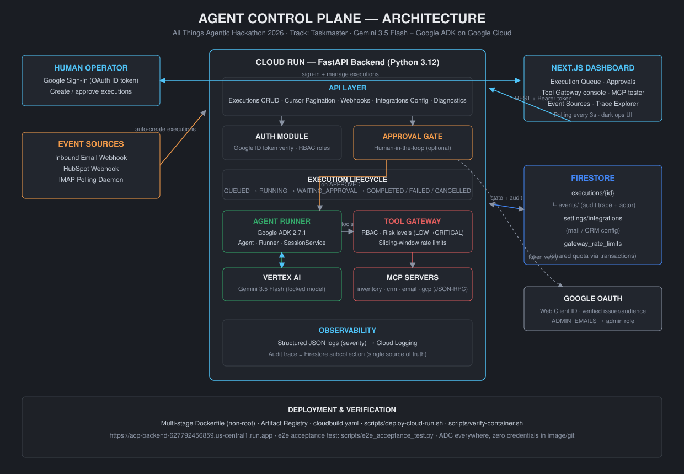

# Agent Control Plane

Agent Control Plane (ACP) is a compact control plane for human-approved autonomous
workflows. All Things Agentic Hackathon 2026 — Track: Taskmaster / Multi-step
Autonomous Workflow.

Workdir: `/home/blaz/www/agent-control-plane`
GCP project: `acp-hackathon-2026-505906` (region: us)

## Core vertical slice



```text
Google sign-in -> create execution -> human approval -> ADK Gemini runner
-> Firestore state -> polling -> result and audit trace
```

- Executions lifecycle: QUEUED, RUNNING, WAITING_APPROVAL, COMPLETED, FAILED, CANCELLED.
- Approval requires a verified Google ID token; the verified actor is stored in the audit trail.
- Inbound email (IMAP daemon) and HubSpot webhooks create executions automatically.
- Every tool call passes through the Tool Gateway: RBAC roles, risk classification,
  sliding-window rate limits (Firestore-backed shared quota on Cloud Run).
- MCP servers expose typed tools over JSON-RPC 2.0 through the same gateway boundary.
- Audit events live in Firestore at `executions/{execution_id}/events` — this is the
  single audit system; application logs are structured JSON for Cloud Logging only.

## Tech stack

- Backend: Python 3.12, FastAPI, Uvicorn
- Agent runtime: Google ADK 2.7.1 (Agent, Runner, InMemorySessionService)
- Model: Gemini 3.5 Flash via Vertex AI (locked configuration)
- Database: Firestore
- Auth: Google OAuth Web Client ID + verified ID tokens
- Frontend: Next.js App Router, TypeScript, custom dark enterprise CSS (BuzLab style)

## Project structure

```text
agent-control-plane/
├── backend/
│   ├── main.py        # FastAPI app: executions, approvals, webhooks, integrations
│   ├── agent.py       # ADK/Gemini runner
│   ├── gateway.py     # Tool Gateway: RBAC, risk levels, rate limits
│   ├── mcp.py         # MCP server registry + JSON-RPC 2.0 layer
│   ├── auth.py        # Google token verification, admin derivation
│   ├── config.py      # Pydantic settings
│   └── Dockerfile     # Multi-stage, non-root runtime user
├── frontend/
│   └── app/           # Next.js dashboard (Overview, Tool Gateway, MCP, Event Sources...)
├── scripts/
│   ├── deploy-cloud-run.sh
│   ├── verify-container.sh
│   └── e2e_acceptance_test.py
├── docs/
│   ├── architecture.svg
│   └── DEVPOST_SUBMISSION.md   # Devpost text draft + video script + checklists
├── cloudbuild.yaml
└── PROJECT_CONTEXT.md / PROJECT_PROGRESS.md
```

## Run locally

Backend:

```bash
cd /home/blaz/www/agent-control-plane
source venv/bin/activate
uvicorn backend.main:app --reload --port 8080
```

Frontend:

```bash
cd frontend
npm install
npm run dev   # http://localhost:3000
```

Required env files (never commit them):

- `backend/.env`: `GOOGLE_CLIENT_ID`, `ADMIN_EMAILS`, optional `RATE_LIMIT_BACKEND=memory|firestore`, `FRONTEND_ORIGIN`
- `frontend/.env.local`: `NEXT_PUBLIC_GOOGLE_CLIENT_ID`, `NEXT_PUBLIC_API_BASE_URL`

Google ADC (`gcloud auth application-default login`) is required for Vertex AI and Firestore.

## Deployed backend

Cloud Run (us-central1): https://acp-backend-627792456859.us-central1.run.app

Redeploy: `scripts/deploy-cloud-run.sh` or `cloudbuild.yaml`. Local image check:
`scripts/verify-container.sh`.

## Runbook (operational checks)

```bash
# Liveness
curl -s https://acp-backend-627792456859.us-central1.run.app/health
# {"status":"ok","service":"agent-control-plane"}

# Runtime config
curl -s .../config          # project, region, model

# Gateway telemetry
curl -s .../api/gateway/metrics

# Full connectivity diagnostics (requires Bearer Google token)
POST .../api/gcp/diagnostics
```

Common operations:

- **Logs**: Cloud Run console → Logs tab; entries are JSON with a `severity` field.
- **Rate limit mode**: `RATE_LIMIT_BACKEND=firestore` on Cloud Run (shared quota across
  instances, fails closed); `memory` is local-only default.
- **Admins**: configured via `ADMIN_EMAILS` (backend env only). Policy updates require admin role.
- **Email poller**: toggle ON/OFF from Settings → Integrations Hub in the dashboard;
  config persists in Firestore `settings/integrations`.
- **Executions stuck in RUNNING**: inspect `executions/{id}/events`; failures store `error`.

## Verification commands

```bash
./venv/bin/python -m compileall -q backend
./venv/bin/python -c "from backend.main import app; print(app.title)"
./venv/bin/python -m backend.test_rate_limiter
./venv/bin/python scripts/e2e_acceptance_test.py
cd frontend && npm run build
```

## Demo script (hackathon)

1. Open the dashboard, sign in with Google.
2. Create an execution → appears as WAITING_APPROVAL in the queue.
3. Approve it (or Reject → CANCELLED). Approval actor is recorded.
4. Watch status transition QUEUED → RUNNING → COMPLETED via polling; open the result panel.
5. Open the status badge dropdown → Trace: show lifecycle audit events.
6. Tool Gateway tab: run a tool call with different RBAC roles; show policy/rate-limit rejection.
7. MCP Protocol tab: execute a JSON-RPC tool call through the gateway.
8. Event Sources tab: trigger the inbound-email simulator → new WAITING_APPROVAL execution.
9. Settings → GCP Diagnostics: live Firestore/Vertex connectivity check.

## Security rules

- No client secrets anywhere; OAuth uses the public Web Client ID only.
- Approval identity always comes from a verified Google token.
- Credentials, `.env`, service-account JSON are excluded from images/git.
- Backend image runs as non-root; CORS origin configurable via `FRONTEND_ORIGIN`.

## License

[MIT](LICENSE)
